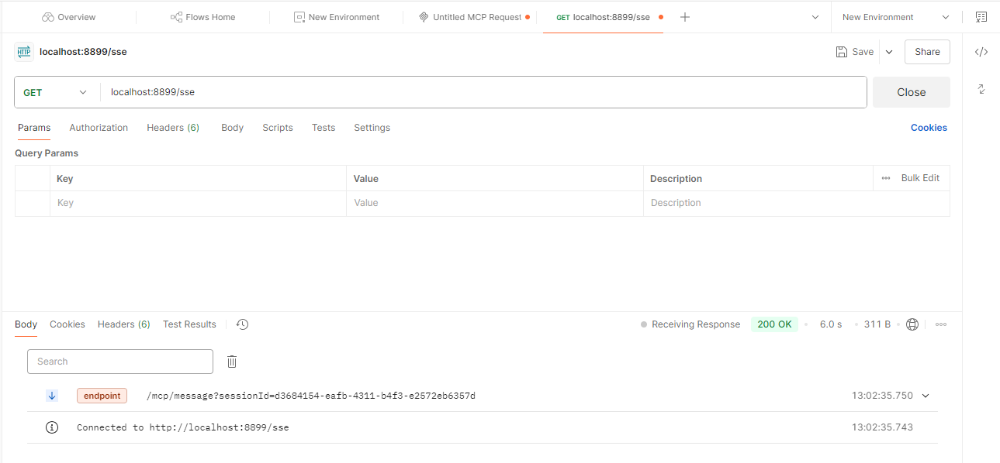
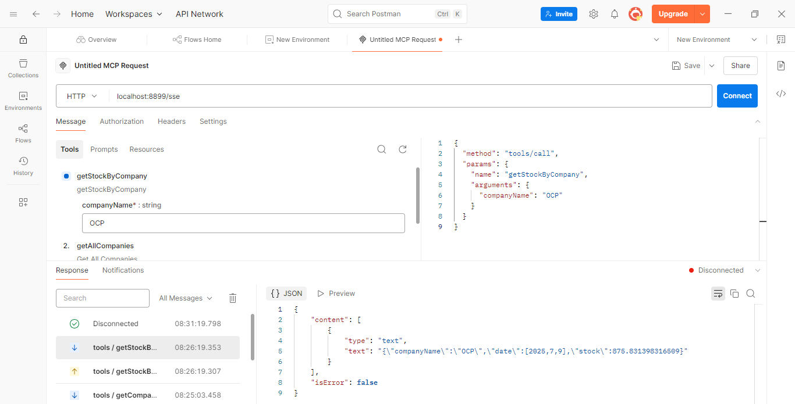
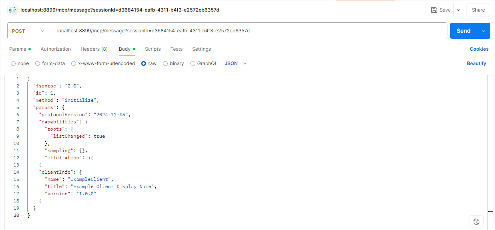
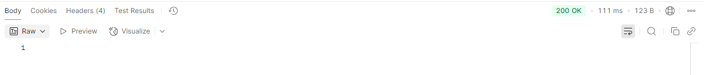
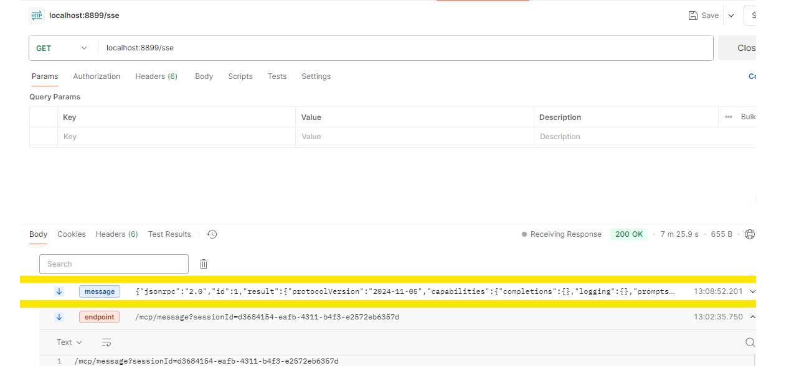
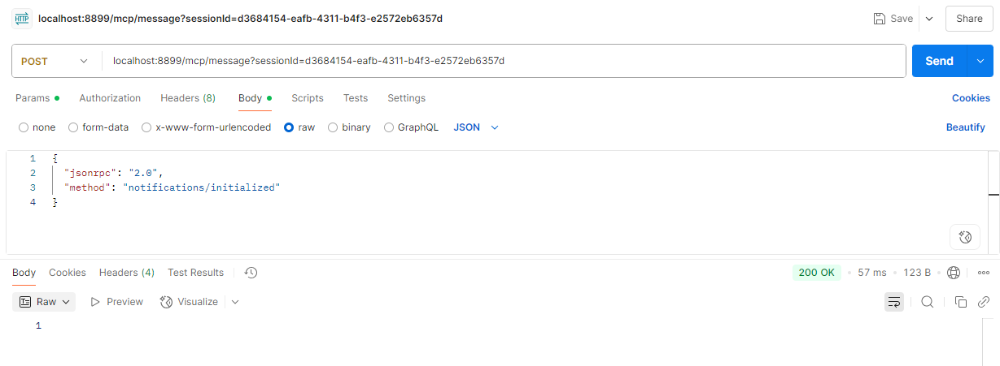
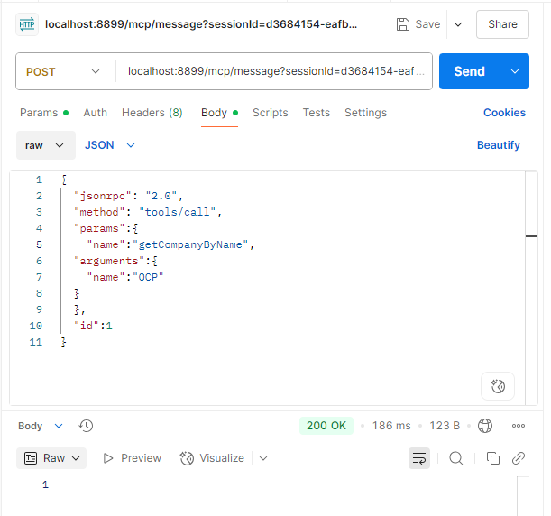
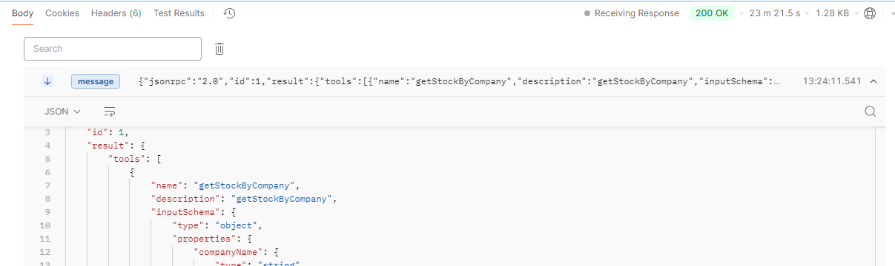

#  Chatbot Agentique avec Spring AI & MCP

##  Objectif du Projet

Ce projet a pour ambition de concevoir un **chatbot intelligent multi-agents**, capable de dialoguer de manière contextuelle avec l’utilisateur et d’interagir avec divers outils métiers, quelle que soit la technologie sous-jacente (Java, Python, NodeJS).

L’élément central est le **protocole MCP (Multi-Agent Communication Protocol)**, qui permet la **communication standardisée entre agents** via SSE ou STDIO.

---

##  Objectifs Fonctionnels

- Définir l’architecture MCP
- Créer des serveurs MCP en Java, Python et NodeJS
- Développer un client intelligent basé sur Spring AI
- Gérer la communication inter-agent (via SSE, STDIO)
- Concevoir une application modulaire et distribuée

---

##  Architecture Générale du Projet

Le projet `mcp-demo-spring-python` est structuré autour de **trois composants principaux** :

### 🔹 `mcp-client` – Client Spring AI

Client Java basé sur Spring Boot, jouant le rôle d’agent conversationnel intelligent. Il orchestre les appels aux outils exposés via MCP.

**Fonctionnalités :**
- Intégration LLMs (Llama3.1, Claude, OpenAI)
- Mémoire contextuelle glissante
- API REST via `AIRestController`
- Découverte dynamique des outils MCP (`mcp-servers.json`)

### 🔹 `mcp-server` – Serveur MCP Java

Serveur Spring Boot qui expose des outils métiers simulés via le protocole MCP et gère les échanges en temps réel (SSE).

**Fonctionnalités :**
- Outils métiers (`StockTools.java`)
- Communication via Server-Sent Events
- Intégration automatique avec Spring AI

### 🔹 `python-mcp-server` – Serveur MCP Python

Serveur Python léger utilisant `FastMCP`, exposant un outil métier et communiquant via STDIO avec le client Spring AI.

**Fonctionnalités :**
- Fonction `get_employee_info`
- Communication STDIO
- Chargement via `mcp-servers.json`

---
## ⚙️ Technologies & Protocoles

| Catégorie      | Technologies                                 |
|----------------|----------------------------------------------|
| Langages       | Java (Spring Boot), Python, NodeJS           |
| IA             | Spring AI, Llama3.1, Claude, OpenAI          |
| Communication  | MCP, SSE, STDIO                              |
| Outils         | Postman, Ollama                              |
| Paradigmes     | Architecture agentique, distribuée, modulaire|

###  Captures d'Écran

---

##  Implémentation Détailée

### 📁 `mcp-server`
- `StockTools.java` : outils métiers (sociétés, actions)
- `McpServerApplication.java` : configuration serveur MCP
- `application.properties` : configuration réseau et SSE

### 📁 `mcp-client`
- `AIAgent.java` : agent conversationnel Spring AI
- `AIRestController.java` : contrôleur REST
- `McpClientApplication.java` : initialisation du client
- `mcp-servers.json` : configuration des serveurs externes
- `application.properties` : paramètres LLM & réseau

### 📁 `python-mcp-server`
- `server.py` : expose `get_employee_info`
- Mode STDIO : utilisé pour échanger avec le client Spring AI

---

##  Tests & Démonstrations

- Tester la liste des outils MCP disponibles
- Appels directs : `getAllCompanies`, `getCompanyByName`
- Tester la communication en temps réel `/mcp/message`
- Utilisation de Postman pour simuler les échanges

---

##  Problèmes Rencontrés

| Problème                           | Cause possible                          |
|-----------------------------------|------------------------------------------|
| Blocage `server.py`               | Problème de STDIO ou dépendance Python   |
| `ollama run llama3.1` bloqué      | Ressources insuffisantes ou driver manquant |

---

##  Conclusion

Ce projet démontre la puissance d’une **architecture multi-agents interopérable**, capable d’intégrer des outils développés en plusieurs langages, tout en restant pilotée par un agent intelligent. Il représente une base robuste pour développer des systèmes **distribués, intelligents et modulaires**.

---

##  Réalisé par

**Zakaria Falkou**  
_Master SDIA – Faculté des Sciences, Meknès_

